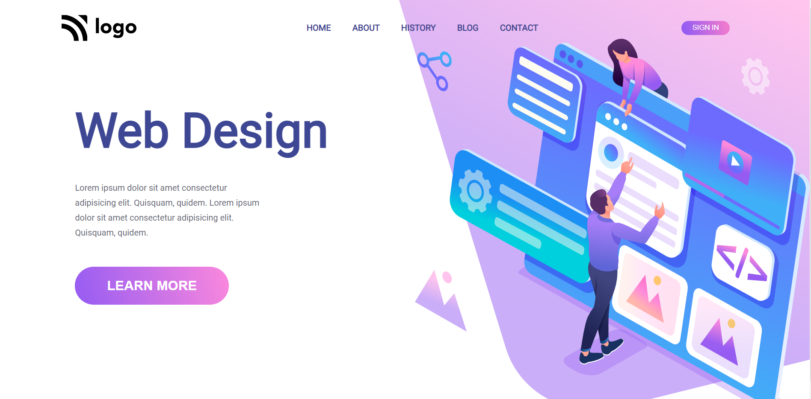

# Project 08 - HTML and CSS

By Piyush Bhatt

Deployed link of website &nbsp; 

 

# [Link to Project 08](https://webdesignlandingpage.netlify.app)

 

# Preview of the Project.

 

## What I learnt in this Project?

- I learned **Positioning property** how to position elements and images inside body.
- I also learnt about how to make beautiful **buttons using gradients**.
- I also learnt how to use **illustration** and **changing shape and size** of illustration.

  

# Time Taken to complete  this project is 5 hour.